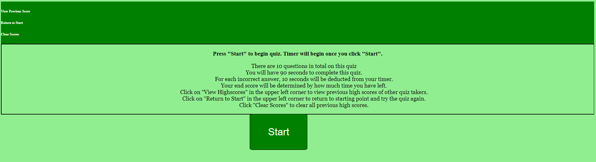

## JavaScript-Quiz

## Description
This is a program that quizes users on basic JavaScript information learned so far in the coding bootcamp. Upon clicking the "Start" button, a timer begins counting down from 90 seconds and the first question displays. At the end of the quiz, user can enter their intials to save their score in the local storage.

## Badges
N/A

## Visuals

## Installation
N/A

## Usage
Use this quiz to test your knowledge of JavaScript. Each time the user clicks on an option, the quiz advances to the next question. If the user answers a question wrong, 10 seconds get deducted from the timer. By the end of the quiz, the users score is determined by how much time is left on the timer. If the user clicks "View Previous Score" in the upper left corner of the page they can view a list of scores from previous users who have taken the quiz. If the user finds themselves halfway through the quiz or on the score screen and would like to try the quiz again, they can click "Return to Start" in the upper left corner to stop the current timer and return to the start screen. If the user would like to clear out the high scores list, they can click on "Clear Scores" to clear out local storage and clear the high scores page. If the user does not enter any initials in at the results screen they will be met with a message urging them to enter valid initials or the score will not be logged.

## Support
N/A

## Authors and acknowledgment
This coding was written by myself, Ida Whitcomb, with help from UNH coding bootcamp tutors and askBCS learning assistants

## License
N/A
